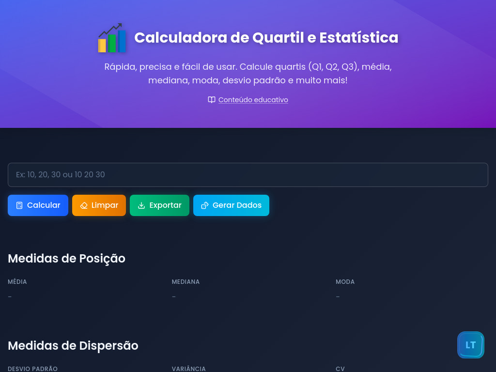

<p align="center">
  
</p>

<h1 align="center">Calculadora de Quartil e Estatística</h1>

<p align="center">
  <strong>Ferramenta online gratuita para análise estatística</strong>
</p>

<p align="center">
  <a href="https://quartil.vercel.app/">
    
  </a>
  <a href="https://github.com/LuisT-ls/QUARTIL/blob/main/LICENSE">
    
  </a>
  <a href="https://vercel.com">
    
  </a>
</p>

---

## 📸 Preview

<p align="center">
  <strong>Desktop</strong>
</p>
<p align="center">
  
</p>
<p align="center">
  <strong>Mobile</strong>
</p>
<p align="center">
  
</p>

---

## 📋 Sobre o projeto

**Quartil** é uma calculadora de estatística online que permite calcular quartis (Q1, Q2, Q3), medidas de posição, dispersão, gerar tabelas de frequência, gráficos e exportar resultados em múltiplos formatos. Inclui uma **página de conteúdo educativo** com história, fórmulas e exemplos resolvidos. Ideal para estudantes, professores e profissionais que precisam de análise estatística rápida e precisa.

### ✨ Funcionalidades

| Recurso | Descrição |
|---------|-----------|
| **Conteúdo Educativo** | Página `/aprender` com quartis, medidas de posição, gráficos e tabela de frequência — história, fórmulas e exemplos |
| **Medidas de Posição** | Média, mediana e moda com fórmulas explicadas |
| **Medidas de Dispersão** | Desvio padrão, variância e coeficiente de variação |
| **Quartis** | Q1, Q2 (mediana), Q3, IQR e detecção de outliers |
| **Gráficos** | Histograma e boxplot interativos (Chart.js) com legendas |
| **Tabela de Frequência** | Automática (Sturges) ou manual por classes |
| **Exportação** | PDF, TXT, CSV, JSON e XLSX |
| **Gerar Dados** | Números aleatórios para testes |
| **Modo Offline** | Modal informativo quando sem conexão |

### 🎯 Uso rápido

1. Insira os dados separados por vírgula ou espaço: `10, 20, 30, 40, 50`
2. Clique em **Calcular**
3. Visualize resultados, gráficos e exporte no formato desejado

Acesse [quartil.vercel.app/aprender](https://quartil.vercel.app/aprender) para conteúdo didático sobre quartis, gráficos e medidas de posição.

---

## 🛠️ Tecnologias

- **Framework**: [Next.js 16](https://nextjs.org/) (App Router) + [React 19](https://react.dev/)
- **Linguagem**: [TypeScript](https://www.typescriptlang.org/)
- **Estilização**: [Tailwind CSS 4](https://tailwindcss.com/)
- **Gráficos**: [Chart.js](https://www.chartjs.org/)
- **Ícones**: [Lucide React](https://lucide.dev/)
- **Exportação**: jsPDF, xlsx
- **Deploy**: [Vercel](https://vercel.com/)

---

## 🚀 Como executar

### Pré-requisitos

- [Node.js](https://nodejs.org/) 18+
- npm ou pnpm

### Instalação

```bash
# Clone o repositório
git clone https://github.com/LuisT-ls/QUARTIL.git
cd QUARTIL

# Instale as dependências
npm install

# Inicie o servidor de desenvolvimento
npm run dev
```

Acesse [http://localhost:3000](http://localhost:3000).

### Scripts disponíveis

| Comando | Descrição |
|---------|-----------|
| `npm run dev` | Servidor de desenvolvimento |
| `npm run build` | Build de produção |
| `npm run start` | Inicia o servidor de produção |
| `npm run lint` | Executa o ESLint |
| `npm test` | Executa os testes unitários |
| `npm run test:e2e` | Executa o smoke test E2E localmente |
| `BASE_URL=https://quartil.vercel.app npm run test:e2e` | Executa o smoke test contra a produção |

---

## 📁 Estrutura do projeto

```
QUARTIL/
├── src/
│   ├── app/                  # App Router, layout, rotas
│   │   ├── layout.tsx
│   │   ├── page.tsx
│   │   ├── aprender/         # Conteúdo educativo
│   │   │   ├── layout.tsx    # JSON-LD LearningResource
│   │   │   └── page.tsx
│   │   ├── robots.ts         # Geração de robots.txt
│   │   └── sitemap.ts        # Geração de sitemap.xml
│   ├── components/
│   │   ├── calculator/       # Entrada, export, popups
│   │   ├── layout/           # Header, Footer, etc.
│   │   ├── sections/         # Seções da página
│   │   └── seo/              # JSON-LD schema
│   ├── context/              # CalculatorContext
│   └── lib/                  # Cálculos estatísticos
├── public/                   # Assets estáticos
│   ├── img/                  # Imagens de preview (OG, README)
│   ├── logo/
│   └── favicon/
├── docs/                     # Documentação
│   └── MIGRACAO.md           # Guia de migração Next.js
└── README.md
```

---

## 🔍 SEO e acessibilidade

- **Meta tags** otimizadas (title ~55 chars, description 70–155 chars)
- **Open Graph** e **Twitter Cards** para compartilhamento nas páginas principal e `/aprender`
- **JSON-LD** schema `WebApplication` (página principal) e `LearningResource` (página educativa)
- **robots.txt** e **sitemap.xml** dinâmicos (inclui `/aprender`)
- **Canonical URLs** e keywords específicas por página
- **Links internos** entre calculadora e conteúdo educativo
- **Links externos** com anchor text descritivo
- **WCAG 2.1** (foco visível, contraste, aria-labels)

---

## 📞 Contato

| Canal | Link |
|-------|------|
| **GitHub** | [@LuisT-ls](https://github.com/LuisT-ls) |
| **LinkedIn** | [luis-tei](https://www.linkedin.com/in/luis-tei) |
| **Email** | luishg213@outlook.com |

---

## 📄 Licença

Este projeto está sob a licença **MIT**. Consulte o arquivo [LICENSE](LICENSE) para detalhes.

---

<p align="center">
  <strong>⭐ Se este projeto te ajudou, considere dar uma estrela no GitHub!</strong>
</p>
<p align="center">
  <a href="https://quartil.vercel.app/">quartil.vercel.app</a>
</p>
